```mermaid
graph TB
    subgraph "Client Layer"
        A[Browser] --> B[EJS Templates]
        B --> C[HTML/CSS UI]
    end
    
    subgraph "Server Layer"
        D[Express.js Server] --> E[Route Handlers]
        E --> F[Middleware]
        F --> G[Controllers]
    end
    
    subgraph "Data Layer"
        H[In-Memory Storage] --> I[Posts Array]
        I --> J[CRUD Operations]
    end
    
    A -->|HTTP Requests| D
    E -->|Process| G
    G -->|Render| B
    G -->|Data Access| H
    
    style A fill:#61dafb,stroke:#000,stroke-width:2px
    style D fill:#000000,stroke:#fff,stroke-width:2px
    style H fill:#47a248,stroke:#000,stroke-width:2px
    style B fill:#b4ca65,stroke:#000,stroke-width:2px
```

<div align="center">

# 🔗 **LinkUp**

### *Simple Social Media Platform for Learning REST APIs with Node.js & Express*

[](https://github.com/yourusername/LinkUp)
[](https://github.com/yourusername/LinkUp/stargazers)
[](https://github.com/yourusername/LinkUp/commits)
[](https://github.com/yourusername/LinkUp/issues)
[](LICENSE)

[](https://nodejs.org/)
[](https://expressjs.com/)
[](https://ejs.co/)
[](https://restfulapi.net/)

[**🚀 Live Demo**](#) • [**📖 Documentation**](https://github.com/yourusername/LinkUp/wiki) • [**🐛 Report Bug**](https://github.com/yourusername/LinkUp/issues) • [**✨ Request Feature**](https://github.com/yourusername/LinkUp/issues)

</div>

---

## 🌟 **Introduction**

**LinkUp** is a lightweight social media platform designed specifically for developers learning REST API development. Built with Node.js and Express.js, it provides a hands-on experience in creating, reading, updating, and managing posts through clean and intuitive interfaces.

### 🎯 **The Problem**
Learning REST APIs can be abstract and confusing without practical implementation. Many tutorials focus on theory but lack a real-world project that ties everything together.

### 💡 **Our Solution**
LinkUp offers a complete, working social media platform where you can see REST principles in action. Every feature is built around RESTful architecture, making it the perfect learning companion for backend development.

### 🚀 **What Makes LinkUp Unique**
- **🎓 Education-First**: Designed specifically for learning REST APIs
- **📝 Clean Codebase**: Easy-to-understand code structure for beginners
- **🛠️ Practical Learning**: Real-world CRUD operations implementation
- **⚡ Lightweight**: Minimal dependencies, maximum learning
- **🎨 Simple UI**: Focus on backend without complex frontend distractions

---

## ✨ **Features**

<table>
<tr>
<td width="50%">

### 🎬 **Core Features**
- 📝 **Create Posts** - Share your thoughts and ideas
- ✏️ **Update Posts** - Edit existing content seamlessly
- 👁️ **View Posts** - Browse all posts and view details
- 🛡️ **Error Handling** - Custom error pages for graceful failures
- 🎨 **Dynamic Views** - EJS templates for server-side rendering
- 🔄 **REST Architecture** - Following RESTful best practices

</td>
<td width="50%">

### 🛡️ **Learning Benefits**
- ⚡ **Hands-On Practice** - Real CRUD operations
- 🔍 **API Design** - Understand REST principles
- 🎯 **Express Routing** - Master route handling
- 📦 **Template Engines** - Work with EJS
- 🧪 **Testing-Ready** - Structure for easy testing
- 💻 **Clean Code** - Industry-standard practices

</td>
</tr>
</table>

---

## 🏗️ **System Architecture**



---

## 🛠️ **Tech Stack**

| Category | Technology | Description |
|----------|------------|-------------|
| **Backend** |  | JavaScript runtime environment |
| **Framework** |  | Minimalist web framework |
| **Template Engine** |  | Embedded JavaScript templating |
| **Architecture** |  | RESTful API design pattern |
| **Middleware** |  | Request body parsing |
| **Utilities** |  | Unique ID generation |

---

## 🌐 **REST API Endpoints**

### **Complete API Reference**

| Method | Endpoint | Description | Request Body |
|--------|----------|-------------|--------------|
| `GET` | `/posts` | Fetch all posts | - |
| `POST` | `/posts` | Create a new post | `{ username, content }` |
| `GET` | `/posts/:id` | Get specific post details | - |
| `PATCH` | `/posts/:id` | Update existing post | `{ content }` |

### **Example API Usage**

#### **📋 Fetch All Posts**
```http
GET /posts
```
**Response:**
```json
[
  {
    "id": "abc123",
    "username": "johndoe",
    "content": "Hello, LinkUp!"
  }
]
```

#### **➕ Create New Post**
```http
POST /posts
Content-Type: application/x-www-form-urlencoded

username=johndoe&content=My first post!
```
**Response:**
```json
{
  "success": true,
  "message": "Post created successfully"
}
```

#### **🔍 Get Specific Post**
```http
GET /posts/abc123
```
**Response:**
```json
{
  "id": "abc123",
  "username": "johndoe",
  "content": "Hello, LinkUp!"
}
```

#### **✏️ Update Post**
```http
PATCH /posts/abc123
Content-Type: application/x-www-form-urlencoded

content=Updated post content
```
**Response:**
```json
{
  "success": true,
  "message": "Post updated successfully"
}
```

---

## 📦 **Installation & Setup**

### **Prerequisites**
- Node.js 14.x or higher
- npm or yarn package manager
- Git installed on your system
- Text editor (VS Code recommended)

### **1️⃣ Clone the Repository**

```bash
git clone https://github.com/VAMSHIYADAV46/linkUp.git
cd linkUp

```

### **2️⃣ Install Dependencies**

```bash
# Install all required packages
npm install
```

### **3️⃣ Project Structure**

```
LinkUp/
├── views/
│   ├── index.ejs       # All posts view
│   ├── show.ejs        # Single post details
│   ├── new.ejs         # Create new post form
│   ├── edit.ejs        # Edit post form
│   └── error.ejs       # Custom error page
├── public/
│   └── style.css       # Stylesheet
├── index.js            # Main server file
├── package.json        # Project dependencies
└── README.md           # Documentation
```

### **4️⃣ Start the Server**

```bash
# Development mode
node index.js

# Or with nodemon for auto-restart
nodemon index.js
```

### **5️⃣ Access the Application**

Open your browser and navigate to:
```
http://localhost:8080
```

---

## 💻 **Usage Guide**

### **Getting Started**

1. **View All Posts**: Navigate to the homepage to see all posts
2. **Create Post**: Click "New Post" button and fill in the form
3. **View Details**: Click on any post to see full details
4. **Edit Post**: Click "Edit" button on post details page
5. **Update Content**: Modify the content and save changes

### **Code Examples**

#### **Creating a New Route**
```javascript
// GET route to display all posts
app.get('/posts', (req, res) => {
  res.render('index.ejs', { posts });
});

// POST route to create new post
app.post('/posts', (req, res) => {
  let { username, content } = req.body;
  let id = uuidv4();
  posts.push({ id, username, content });
  res.redirect('/posts');
});
```

#### **Updating with PATCH**
```javascript
// PATCH route to update post
app.patch('/posts/:id', (req, res) => {
  let { id } = req.params;
  let newContent = req.body.content;
  let post = posts.find(p => p.id === id);
  post.content = newContent;
  res.redirect('/posts');
});
```
<!-- 
### **Screenshots**

<table> 
<tr>
<td width="50%">

#### 🏠 **Homepage - All Posts**


</td>
<td width="50%">

#### ➕ **Create New Post**


</td>
</tr>
<tr>
<td width="50%">

#### 📄 **Post Details**


</td>
<td width="50%">

#### ✏️ **Edit Post**


</td>
</tr>
</table>
-->
---

## 📚 **Learning Outcomes**

### **What You'll Master:**

<table>
<tr>
<td width="33%">

#### 🎯 **REST Principles**
- Resource-based URLs
- HTTP method semantics
- Stateless architecture
- Uniform interface

</td>
<td width="33%">

#### 🛠️ **Express.js Skills**
- Routing and middleware
- Request/response handling
- Template rendering
- Error handling

</td>
<td width="33%">

#### 💡 **Best Practices**
- Code organization
- MVC pattern basics
- RESTful naming conventions
- Clean code principles

</td>
</tr>
</table>

### **Key Concepts Covered:**

- ✅ **CRUD Operations** - Complete create, read, update workflow
- ✅ **HTTP Methods** - GET, POST, PATCH usage and differences
- ✅ **Route Parameters** - Dynamic URL handling with `:id`
- ✅ **Request Body Parsing** - Working with form data and middleware
- ✅ **Template Rendering** - Server-side view generation with EJS
- ✅ **Error Handling** - Custom error pages and graceful failures
- ✅ **Middleware** - Understanding Express middleware pipeline
- ✅ **Redirects** - Proper navigation after form submissions

---

## 🗺️ **Roadmap**

### **Phase 1: Core Features** ✅
- [x] Basic CRUD operations
- [x] RESTful routing
- [x] EJS template integration
- [x] Error handling

### **Phase 2: Enhanced Features** 🚧
- [ ] Delete post functionality
- [ ] Input validation
- [ ] Search and filter posts
- [ ] Pagination support
- [ ] Post timestamps

### **Phase 3: Database Integration** 📋
- [ ] MongoDB integration
- [ ] Persistent data storage
- [ ] User profiles
- [ ] Post likes/reactions
- [ ] Comments system

### **Phase 4: Authentication** 🔐
- [ ] User registration
- [ ] Login/logout system
- [ ] Session management
- [ ] Protected routes
- [ ] JWT authentication

### **Phase 5: Advanced Features** 🎯
- [ ] Image upload support
- [ ] Real-time updates
- [ ] REST API documentation
- [ ] API rate limiting
- [ ] Comprehensive testing

---

## 🤝 **Contributing**

We welcome contributions from learners and developers! Here's how you can help:

### **How to Contribute**

1. **Fork the Repository**
   ```bash
   
   git clone https://github.com/VAMSHIYADAV46/linkUp.git
   cd linkUp

   ```

2. **Create Feature Branch**
   ```bash
   git checkout -b feature/YourFeature
   ```

3. **Make Your Changes**
   - Keep code simple and readable
   - Follow existing code style
   - Add comments for complex logic
   - Test your changes thoroughly

4. **Commit Your Changes**
   ```bash
   git add .
   git commit -m "✨ Add YourFeature"
   ```

5. **Push to Your Fork**
   ```bash
   git push origin feature/YourFeature
   ```

6. **Open Pull Request**
   - Describe what you've added
   - Explain why it's useful for learning
   - Include screenshots if applicable

### **Contribution Ideas**

- 📝 Improve documentation
- 🐛 Fix bugs
- ✨ Add new features
- 🎨 Enhance UI/UX
- 🧪 Add tests
- 📖 Create tutorials

---

## 📄 **License**

This project is licensed under the MIT License - see the [LICENSE](LICENSE) file for details.

```
MIT License

Copyright (c) 2024 MEKALA VAMSHI YADAV

Permission is hereby granted, free of charge, to any person obtaining a copy
of this software and associated documentation files (the "Software"), to deal
in the Software without restriction...
```

---

## 🙏 **Acknowledgements**

### **Special Thanks To:**

- 🟢 [**Node.js Foundation**](https://nodejs.org/) - For the powerful JavaScript runtime
- ⚡ [**Express.js Team**](https://expressjs.com/) - For the minimalist web framework
- 📝 [**EJS Contributors**](https://ejs.co/) - For the simple templating engine
- 📚 [**REST API Community**](https://restfulapi.net/) - For API design best practices
- 🎓 **All Developers Learning REST APIs** - This project is for you!

### **Inspired By:**
- Twitter - For simple post-based interactions
- Reddit - For community content sharing
- Dev.to - For developer-focused platforms

---
## 👨‍💻 **Author**

<div align="center">

### **Mekala Vamshi Yadav**
*Full-Stack Developer & REST API Enthusiast*

[](https://github.com/VAMSHIYADAV46)
[](https://www.linkedin.com/in/mekalavamshiyadav/)
[](https://vamshis-portfolio.onrender.com)

</div>

---

## 🔗 **Project Links**

- 🌐 **Repository**: [https://github.com/VAMSHIYADAV46/linkUp](https://github.com/VAMSHIYADAV46/linkUp)
- 📖 **Documentation**: [https://github.com/VAMSHIYADAV46/linkUp/wiki](https://github.com/VAMSHIYADAV46/linkUp/wiki)
- 🐛 **Issue Tracker**: [https://github.com/VAMSHIYADAV46/linkUp/issues](https://github.com/VAMSHIYADAV46/linkUp/issues)
- 💬 **Discussions**: [https://github.com/VAMSHIYADAV46/linkUp/discussions](https://github.com/VAMSHIYADAV46/linkUp/discussions)
- 📚 **Learning Resources**: [REST API Guide](https://restfulapi.net/)

---

<div align="center">

### ⭐ **Star this repo if you find it helpful for learning!**


**Built with ❤️ for Developers Learning REST APIs**

*Happy Coding! 🚀*

</div>
